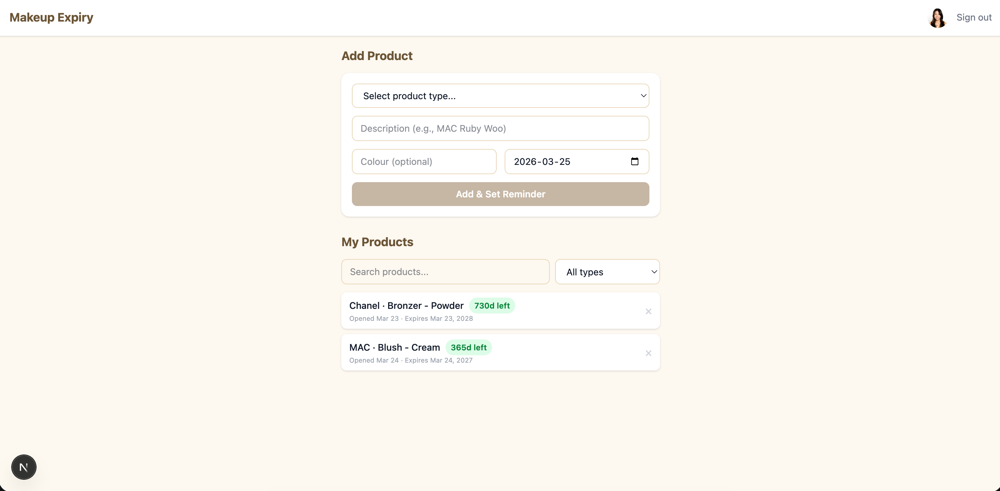

# Makeup Expiry Reminder

Track when you open your makeup products and get a Google Calendar reminder before they expire.



## Features

- **Track opened products** — Log when you open a makeup product and the app calculates the expiry date automatically
- **Google Calendar reminders** — A calendar event is created 2 weeks before expiry so you know when to replace it
- **Search and filter** — Find products by name, colour, or filter by product type
- **Edit and remove** — Click any product to update its details, or remove it (also deletes the calendar reminder)

## Product Types

Supports 25 makeup categories including foundation, concealer, mascara, eyeliner, eyeshadow, lipstick, lip gloss, blush, bronzer, highlighter, brow products, setting spray, setting powder, primer, and makeup remover — each with their standard Period After Opening (PAO) expiry.

## Setup

1. Clone the repo
2. Install dependencies: `pnpm install`
3. Set up a Google Cloud project with the Google Calendar API enabled and OAuth 2.0 credentials
4. Create a `.env.local` file:
   ```
   DATABASE_URL="file:./dev.db"
   AUTH_GOOGLE_ID="your-google-client-id"
   AUTH_GOOGLE_SECRET="your-google-client-secret"
   AUTH_SECRET="generate-with-openssl-rand-base64-32"
   ```
5. Push the database schema: `DATABASE_URL="file:./dev.db" npx prisma db push`
6. Run the dev server: `pnpm dev`
7. Open http://localhost:3000

## Tech Stack

- Next.js 15 + TypeScript
- Prisma + SQLite
- Auth.js (NextAuth v5) with Google OAuth
- Google Calendar API
- Tailwind CSS
